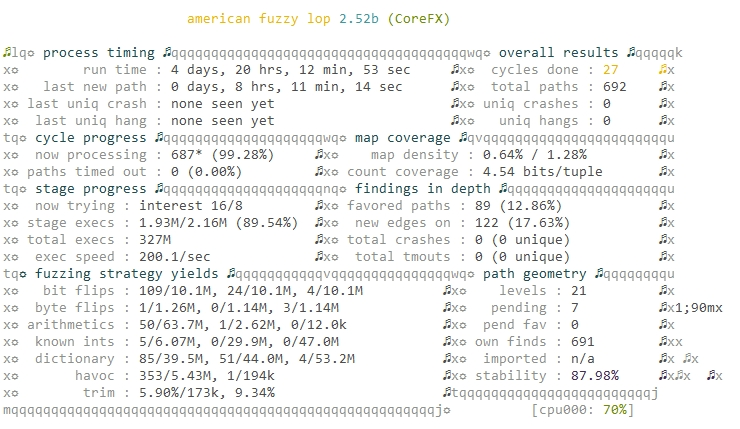
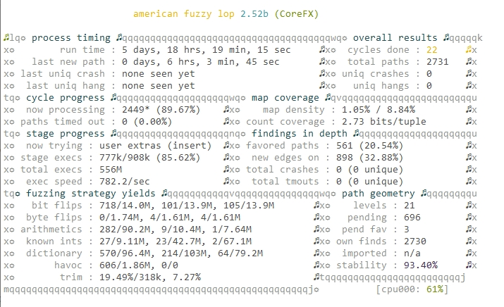

# Результаты фаззинга по целям

Тут собраны результаты фаззиннга по подготовленным целям.

## JsonDocument.Parse



Сборка контейнера:
``` bash
docker build -f Dockerfile --build-arg FUZZ_TARGET_LIBRARY=System.Text.Json.dll --build-arg FUZZ_TARGET_FOLDER=JsonDocument.Parse --tag=jsondocument.parse .
```

Запуск:
``` bash
docker run -ti -v $(pwd)/findings:/app/findings jsondocument.parse
```

Результаты [15_06_2021_findings.zip](JsonDocument.Parse/15_06_2021_findings.zip)

## XmlSerializer.Deserialize



Сборка контейнера:
``` bash
docker build -f Dockerfile --build-arg FUZZ_TARGET_LIBRARY=System.Private.Xml.dll --build-arg FUZZ_TARGET_FOLDER=XmlSerializer.Deserialize --tag=xmlserializer.deserialize .
```

Запуск:
``` bash
docker run -ti -v $(pwd)/findings:/app/findings xmlserializer.deserialize
```

Результаты [22_06_2021_findings.zip](XmlSerializer.Deserialize/22_06_2021_findings.zip)